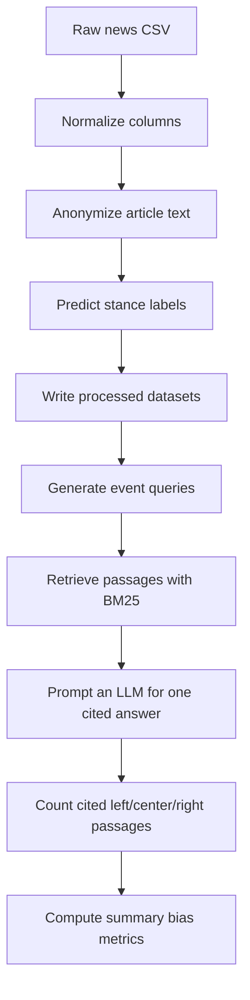

# Political Citation Bias

This repository contains a small research pipeline for measuring whether a retrieval-augmented generation setup cites left-, center-, or right-leaning news sources unevenly when answering the same question. The code prepares article datasets, anonymizes source-identifying text, generates event-level queries, runs several retrieval conditions, and summarizes citation patterns as bias metrics.

The repository supports a thesis workflow built around two related ideas:

1. Testing whether model answers cite politically different sources at different rates.
2. Testing whether anonymizing outlet-identifying signals changes that citation behavior.

## What The Project Does

At a high level, the pipeline is:



The main comparison conditions implemented in the code are:

| Condition | Retrieval text | Retrieval balancing |
| --- | --- | --- |
| `c1_baseline` | Original article text | None |
| `c2_anonymized` | Anonymized article text | None |
| `c3_balanced` | Anonymized article text | Attempts a left/center/right balanced retrieved set |

## Repository Structure

| Path | Purpose |
| --- | --- |
| `data_preprocessing.py` | Dataset-specific preprocessing for the included AllSides CSV. Produces balanced and binary processed datasets. |
| `document_formatter.py` | General formatter for arbitrary news CSVs. Normalizes schemas, anonymizes text, predicts stance labels, and writes processed outputs for the RAG pipeline. |
| `prompt_gen.py` | Samples events and generates concise event queries from left/right or left/center/right article groups. |
| `rag_setup.py` | Runs retrieval + generation experiments and computes citation metrics. |
| `model_loader.py` | Standalone Hugging Face inference helper. It is not used by the rest of the pipeline. |
| `config.json` | Model, generation, retrieval, threshold, subset, and metrics settings. |
| `formatter_config.json` | Input dataset configuration for `document_formatter.py`. |
| `.env.example` | Example API environment variables. |
| `reqiurements.txt` | Python dependency lockfile. Note the filename typo: `reqiurements.txt`, not `requirements.txt`. |
| `data/raw/` | Raw datasets currently committed to the repository. |

## Raw Data Included In The Repository

The repository currently contains these raw datasets:

| File | Observed schema |
| --- | --- |
| `data/raw/allsides_balanced_news_headlines-texts.csv` | Columns include `title`, `source`, `text`, `bias_rating` and supporting metadata. |
| `data/raw/poliOscar_articles_DE.csv` | Columns include `Political Leaning`, `Article UUID`, `Source URL`, `Article Text`. |
| `data/raw/poliOscar_articles_ES.csv` | Columns include `Political Leaning`, `Article UUID`, `Source URL`, `Article Text`. |

`document_formatter.py` is the more flexible entrypoint for these alternative schemas because it maps multiple alias names onto a standard internal schema.

## Core Concepts

### Article anonymization

Both preprocessing paths remove obvious publisher-identifying features from article text, including:

- URLs
- email addresses
- social media handles
- simple byline patterns such as `By Jane Doe`
- known outlet names extracted from the dataset itself

The goal is to test whether retrieval and downstream citation behavior changes when outlet identity is less explicit in the text.

### Event grouping

The code groups related articles under an `event_id` so multiple ideologically different articles can be tied to the same news event. Depending on the script, event IDs are derived from titles or existing cluster-like columns.

### Citation scoring

The experiment asks the generator to answer using retrieved passages and include a citation such as `[1]`. The code then maps cited passage indices back to the passages' bias labels and aggregates counts.

## Configuration

### `config.json`

The main configuration file controls:

- `models`: the generation models used in experiments
- `classifier_model`: the model used by `document_formatter.py` for stance prediction
- `default_generation`: temperature, token count, and sampling settings for answer generation
- `retrieval`: retrieved document count and left/center/right balancing targets
- `thresholds.stance_confidence`: minimum confidence for stance-balanced retrieval filtering
- `subset`: default query subset size and random seed
- `metrics.mode`: one of `cpi_binary`, `balance_three`, or `both`

Current defaults:

- `top_k = 6`
- target retrieval mix of `2` left, `2` center, `2` right passages
- subset size `100`
- seed `42`

### `formatter_config.json`

This file tells `document_formatter.py` how to load a raw CSV. It includes:

- the input path
- preferred raw column names
- label mapping hints
- an `event_mode` value

Important: the committed `formatter_config.json` points to `data/raw/israel_palestine_conflict_news_dataset.csv`, which is not present in the repository. You will need to update this path before running the formatter.

## Installation

This project targets Python and uses pandas, OpenAI-compatible clients, BM25 retrieval, and transformer-related dependencies.

### 1. Create a virtual environment

PowerShell:

```powershell
python -m venv .venv
.\.venv\Scripts\Activate.ps1
```

### 2. Install dependencies

```powershell
pip install -r .\reqiurements.txt
```

## Environment Variables

Create a `.env` file in the repository root.

The codebase currently uses two different credential paths:

### For `document_formatter.py` and `prompt_gen.py`

These scripts expect an OpenAI-compatible endpoint exposed through:

```env
BASE_URL=https://your-openai-compatible-endpoint
HF_TOKEN=your-api-token
```

### For `rag_setup.py`

This script supports either:

```env
OPEN_API_KEY=your-openai-api-key
OPENAI_BASE_URL=https://your-openai-compatible-endpoint
```

or:

```env
BASE_URL=https://your-openai-compatible-endpoint
HF_TOKEN=your-api-token
```

Important caveats:

- `.env.example` currently uses `OPENAI_API_KEY`, but `rag_setup.py` checks for `OPEN_API_KEY`.
- `.env.example` currently uses `HF_BASE_URL`, but the code checks for `BASE_URL`.

If you follow the code exactly, prefer the variable names shown in this README rather than the current example file.

## Input Schema Expectations

### `data_preprocessing.py`

This script is hardcoded to the AllSides dataset at:

```text
data/raw/allsides_balanced_news_headlines-texts.csv
```

It requires these columns:

- `title`
- `text`
- `bias_rating`

It optionally uses:

- `source`

Valid bias labels for this script are:

- `left`
- `center`
- `right`

### `document_formatter.py`

This is the more general ingestion path. It attempts to detect a normalized schema using aliases such as:

- `article_id`, `uuid`, `id`, `doc_id`, `news_id`
- `title`, `headline`, `article_title`
- `text`, `content`, `body`, `article_text`, `description`
- `source`, `outlet`, `publisher`, `domain`
- `url`, `link`, `article_url`
- `published_at`, `date`, `timestamp`
- `event_id`, `cluster_id`, `group_id`, `story_id`
- `bias_rating`, `bias`, `stance`, `political_leaning`
- `veracity_label`, `label`, `truth_label`

If no text column is found, the formatter stops with an error.

## End-To-End Workflow

There are two realistic ways to use the code in this repository.

### Option A: Use the dataset-specific AllSides preprocessor

Run:

```powershell
python .\data_preprocessing.py preprocess
```

This script:

1. Loads the hardcoded AllSides CSV.
2. Keeps only rows labeled `left`, `center`, or `right`.
3. Drops rows with missing `title` or `text`.
4. Builds a binary dataset where each event has both `left` and `right` coverage.
5. Builds a balanced dataset where each event has `left`, `center`, and `right` coverage.
6. Generates `event_id` and `article_id` values.
7. Writes clean, anonymized, events, and audit outputs for both variants.

### Option B: Use the generic formatter for other news datasets

First edit `formatter_config.json` so `raw_path` points to a real dataset in `data/raw/`.

Then run:

```powershell
python .\document_formatter.py --config .\formatter_config.json
```

This script:

1. Loads the configured CSV with encoding fallback.
2. Detects and standardizes the schema.
3. Fills missing IDs and event IDs when needed.
4. Builds anonymized article text.
5. Calls a model to classify each article as `left`, `center`, or `right`.
6. Stores confidence and threshold-passing flags.
7. Writes processed outputs.

Optional interactive mode:

```powershell
python .\document_formatter.py --config .\formatter_config.json --interactive
```

This writes a preview CSV before final output generation.

## Generated Files

Both preprocessing paths write into `data/processed/`.

### Processed article files

- `articles_clean.csv`
- `articles_clean_balanced.csv`
- `articles_clean_binary.csv`
- `articles_anonymized.csv`
- `articles_anonymized_balanced.csv`
- `articles_anonymized_binary.csv`

Depending on which script you use, some of these may be aliases with duplicated contents rather than independently constructed datasets.

### Event files

- `events_balanced.csv`
- `events_balanced_balanced.csv`
- `events_balanced_binary.csv`

### Audit files

- `anonymization_audit.json`
- `anonymization_audit_balanced.json`
- `anonymization_audit_binary.json`

### Query generation files

Created by `prompt_gen.py`:

- `queries_subset_<N>_balanced.csv`
- `queries_subset_<N>_binary.csv`
- `query_generation_failures_<N>_balanced.csv`
- `query_generation_failures_<N>_binary.csv`

### Experiment result files

Created by `rag_setup.py` in `results/`:

- `per_query_results__<condition>_<model>.csv`
- `failed_queries__<condition>_<model>.csv`
- `model_condition_summary__<condition>_<model>.csv`

## Query Generation

After processed anonymized data exists, generate event-level queries with:

```powershell
python .\prompt_gen.py generate-queries --subset-n 100 --variant balanced
```

or:

```powershell
python .\prompt_gen.py generate-queries --subset-n 100 --variant binary
```

What `prompt_gen.py` does:

1. Loads `articles_anonymized_<variant>.csv`.
2. Samples unique events using the configured seed.
3. Pulls one left/right article per event, plus one center article in balanced mode.
4. Prompts a model to produce a concise query answerable by all passages.
5. Saves successful queries and failures separately.

## Running Retrieval And Citation-Bias Experiments

Run one condition at a time:

```powershell
python .\rag_setup.py run-condition --condition c1_baseline --model Qwen/Qwen2.5-7B-Instruct:together --subset-n 100 --metric both
```

Examples:

```powershell
python .\rag_setup.py run-condition --condition c2_anonymized --model Qwen/Qwen2.5-7B-Instruct:together --subset-n 100 --metric both
python .\rag_setup.py run-condition --condition c3_balanced --model Qwen/Qwen2.5-7B-Instruct:together --subset-n 100 --metric both
```

What `rag_setup.py` does:

1. Loads a query set.
2. Loads clean and anonymized corpora.
3. Builds a BM25 index over article text.
4. Retrieves candidate documents for each query.
5. For `c1_baseline`, retrieves from original text.
6. For `c2_anonymized`, retrieves from anonymized text.
7. For `c3_balanced`, attempts to retrieve a target mix of left/center/right passages using stance predictions and then fills any remaining slots with the top BM25 candidates.
8. Shuffles the final passage order before prompting the model.
9. Forces the model toward a single citation in square brackets.
10. Parses cited indices and maps them back to the source bias labels.
11. Writes per-query, failure, and summary outputs.

## Metrics

The summary script computes two related metrics.

### Binary Citation Preference Index

Used for left-vs-right comparisons:

$$
\mathrm{CPI}_{binary} = \frac{L - R}{L + R} \times 100
$$

where:

- $L$ = total unique left citations
- $R$ = total unique right citations

### Three-way balance score

Used when center citations matter:

$$
\mathrm{BalanceScore} = \frac{L - R}{L + C + R} \times 100
$$

where:

- $L$ = total unique left citations
- $C$ = total unique center citations
- $R$ = total unique right citations

Interpretation:

- positive values indicate more left citations than right citations
- negative values indicate more right citations than left citations
- values near zero indicate more balanced citation behavior

## Script-By-Script Notes

### `data_preprocessing.py`

Use this if your study dataset is specifically the included AllSides file. It is simple and deterministic, but not flexible.

### `document_formatter.py`

Use this if you want a more general ingestion layer for other CSV schemas. This is the most reusable script in the repository.

### `prompt_gen.py`

This creates evaluation queries from existing event groups instead of requiring manually written prompts.

### `rag_setup.py`

This is the main experiment runner and metric generator.

### `model_loader.py`

This file defines an `HFModelLoader` wrapper around `huggingface_hub.InferenceClient`, but it appears to be standalone or legacy code. Nothing else in the repository imports it.

## Minimal Reproduction Order

If you want the shortest path to running the project, use this order:

1. Create a virtual environment and install dependencies.
2. Create a `.env` file using the variable names the code actually reads.
3. Choose either `data_preprocessing.py` or `document_formatter.py` to create processed article files.
4. Run `prompt_gen.py generate-queries` for the dataset variant you want.
5. Run `rag_setup.py run-condition` for one or more retrieval conditions.
6. Inspect the CSV summaries in `results/`.

## Suggested Output Interpretation

When comparing conditions, focus on:

- whether anonymization changes the proportion of left/right citations
- whether the balanced retrieval condition reduces citation skew
- how often generation fails to cite correctly
- whether query-generation failures cluster around particular event types or datasets

## Current State Of The Repository

This repository already contains the essential pieces for a citation-bias experiment:

- dataset normalization
- article anonymization
- automatic query generation
- retrieval condition control
- citation parsing
- bias metric computation

What it does not yet provide is a single fully polished, one-command entrypoint. Running experiments currently requires moving through the scripts in sequence and accounting for a few configuration mismatches documented above.
